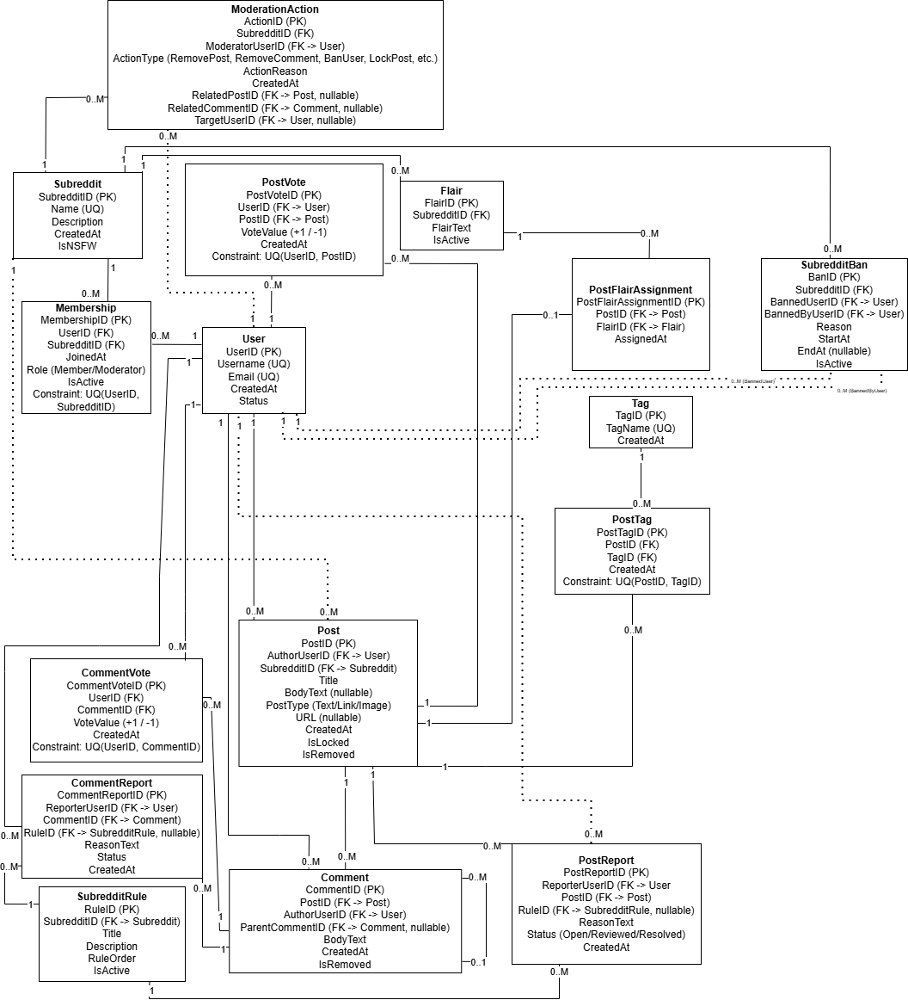

# Reddit-Style Social Content Platform Database  
**Project Proposal – Phase 0**

---

## 1. Document Title & Summary

**System Name:** Reddit-Style Social Content Platform Database  
**Student:** Andrew Hanson
**Course:** SP26: DATABASE SYSTEMS: 17038
**Semester:** Spring 2026

### Summary
This project proposes the design of a relational database system modeled after Reddit. The database will support communities (subreddits), user accounts, posts, comments, voting, moderation actions, and reporting. The system is designed to store structured social content data with clear entity relationships and constraints, enabling efficient queries such as trending posts, user engagement statistics, moderation history, and community growth.

---

## Version / Revision History

| Date       | Version | Note |
|------------|---------|------|
| 2026-02-09 | 1.0.0   | Initial Phase 0 project proposal |

**Versioning Scheme:**  
- **Major** – New project phase  
- **Minor** – Significant content updates  
- **Tiny** – Formatting or minor corrections  

---

## 2. Table of Contents
1. Document Title & Summary  
2. Table of Contents  
3. Introduction  
4. Project Scope  
5. Intended Audience  
6. Preliminary System Design  
7. Preliminary Entities, Attributes, and Relationships  
8. Example Queries / Use Cases  
9. Conclusion  

---

## 3. Introduction

### Purpose
The purpose of this project is to design a database system that supports the core functionality of a Reddit-like platform. The database will store data about users, communities, posts, comment threads, voting behavior, moderation, and content reporting. This database acts as the foundation for creating a scalable and queryable social discussion platform.

### Motivation
Reddit is a strong real-world example of a system with complex data relationships, including hierarchical comments, many-to-many user interactions (votes, memberships), and governance structures (moderators). This makes it an ideal subject for practicing relational modeling, integrity constraints, and ER/EER design.

---

## 4. Project Scope

### In Scope
- User accounts and profiles  
- Communities (subreddits) and membership  
- Posts (text/link/image metadata)  
- Comments (threaded replies)  
- Voting (upvotes/downvotes) on posts and comments  
- Moderators and moderation actions  
- Content reports (flagging)  

### Out of Scope
- Authentication implementation and password storage details  
- Actual media/file storage (images/videos)  
- Real-time chat/messaging  
- Full-text search engine implementation  
- Recommendation algorithm implementation  

---

## 5. Intended Audience
- **Users:** Create posts/comments, vote, join communities, report content  
- **Moderators:** Enforce rules, remove content, manage bans, handle reports  
- **Administrators:** Oversee platform-level data and enforce global policies  

---

## 6. Preliminary System Design

This database will be designed as a normalized relational model. Many-to-many relationships (e.g., memberships, votes) will be represented using associative entities. Threaded comment structure will be represented using a self-referencing relationship. Constraints will be used to ensure valid relationships (e.g., users can vote at most once per item, moderators must belong to a community they moderate).

This Phase 0 design is a first pass and will be refined through ER diagram creation, participation constraints (min, max), and translation to a relational schema in later phases.

---

## 7. Preliminary Entities, Attributes, and Relationships

> This section is being intentionally left as a first draft and will be refined later.

---

### Entity: User
- **Attributes:**  
  - UserID (Primary Key)  
  - Username (Unique)  
  - Email (Unique)  
  - CreatedAt  
  - KarmaScore (optional derived / cached)

---

### Entity: Subreddit (Community)
- **Attributes:**  
  - SubredditID (Primary Key)  
  - Name (Unique)  
  - Description  
  - CreatedAt  
  - RulesText (optional)

---

### Entity: Membership
(Associative entity for User ↔ Subreddit)
- **Attributes:**  
  - MembershipID (Primary Key)  
  - JoinedAt  
  - MemberRole (Member, Moderator) *(role can also be separated into another table later)*  
- **Relationships:**  
  - User ↔ Subreddit (Many-to-Many)

---

### Entity: Post
- **Attributes:**  
  - PostID (Primary Key)  
  - Title  
  - BodyText (nullable)  
  - PostType (Text, Link, Image)  
  - URL (nullable)  
  - CreatedAt  
- **Relationships:**  
  - User → Post (One-to-Many) *(author creates posts)*  
  - Subreddit → Post (One-to-Many) *(posts belong to a community)*  

---

### Entity: Comment
- **Attributes:**  
  - CommentID (Primary Key)  
  - BodyText  
  - CreatedAt  
- **Relationships:**  
  - User → Comment (One-to-Many) *(author writes comments)*  
  - Post → Comment (One-to-Many) *(comments belong to a post)*  
  - Comment → Comment (One-to-Many, self-referencing) *(reply threads)*  
    - ParentCommentID (nullable for top-level comments)

---

### Entity: Vote
(Users vote on posts and comments; one vote per user per target)
- **Attributes:**  
  - VoteID (Primary Key)  
  - VoteType (Upvote, Downvote)  
  - CreatedAt  
  - TargetType (Post, Comment)  
  - TargetID (FK-like reference pattern)  
- **Relationships:**  
  - User → Vote (One-to-Many)

> Note: In implementation, Vote may be split into PostVote and CommentVote to enforce FK constraints cleanly.

---

### Entity: Report
(Users report posts/comments for rule violations)
- **Attributes:**  
  - ReportID (Primary Key)  
  - Reason  
  - CreatedAt  
  - Status (Open, Reviewed, Resolved)  
  - TargetType (Post, Comment)  
  - TargetID  
- **Relationships:**  
  - User → Report (One-to-Many)

---

### Entity: ModerationAction
(Tracks actions taken by moderators)
- **Attributes:**  
  - ActionID (Primary Key)  
  - ActionType (RemovePost, RemoveComment, BanUser, UnbanUser, LockThread)  
  - ActionReason  
  - CreatedAt  
- **Relationships:**  
  - User (Moderator) → ModerationAction (One-to-Many)  
  - Subreddit → ModerationAction (One-to-Many)  
  - Action may reference a PostID, CommentID, or TargetUserID depending on type

---

## 8. Example Queries / Use Cases

1. Show the top 10 posts in a subreddit by score in the last 24 hours  
2. Display a full comment thread for a given post (including replies)  
3. Find all reports that are still open for a subreddit  
4. List all moderation actions taken by a specific moderator in the last 30 days  
5. Compute user karma by summing votes on their posts and comments  
6. Identify the most active users in a subreddit by number of comments/posts  

---

## 9. Conclusion

This proposal outlines a relational database design for a Reddit-style discussion platform with sufficient complexity to support ER/EER modeling and relational schema mapping. The system includes hierarchical comment relationships, many-to-many interactions (membership and voting), and governance/moderation features that reflect real-world requirements. Future phases will refine constraints (min/max participation), enforce referential integrity, and translate the conceptual model into SQL tables.

## 10. Phase 1: Entity-Relationship Diagram and Detailed Design

### 10.1 Overview

Phase 1 expands the preliminary proposal into a fully developed Entity-Relationship (ER) model representing the complete scope of the Reddit-style social content platform.

The ER diagram models all required entities, attributes, relationships, constraints, and cardinality rules necessary to support:

- User accounts
- Communities (subreddits)
- Posts
- Threaded discussions
- Voting systems
- Reporting mechanisms
- Moderation logging
- Subreddit rules and bans
- Flairs and tagging

The design emphasizes:

- Referential integrity
- Logical normalization
- Real-world behavioral constraints
- Scalability and extensibility

The final ER diagram contains **16 entities**, satisfying the project requirement of 10–20 entities and demonstrating sufficient structural complexity for a full-scale platform model.



---

### 10.2 Entity Justification

Below is the rationale for each entity included within the model.

#### Core Identity Entities

**User**  
Represents registered platform accounts. Users can create posts and comments, vote on content, report violations, join communities, and potentially serve as moderators.

**Subreddit**  
Represents communities within the platform. Each post belongs to exactly one subreddit. Rules, moderation actions, bans, and flairs are scoped at the subreddit level.

---

#### Associative Entities

**Membership**  
Resolves the many-to-many relationship between User and Subreddit. Stores:
- Join date
- Role (Member or Moderator)
- Active status  

Constraint: `Unique(UserID, SubredditID)` ensures a user cannot join the same subreddit multiple times simultaneously.

**PostTag**  
Resolves the many-to-many relationship between Post and Tag.  
Constraint: `Unique(PostID, TagID)` prevents duplicate tag assignments.

**PostFlairAssignment**  
Associates a post with at most one flair.  
Constraint: `Unique(PostID)` ensures a post cannot have multiple flairs assigned simultaneously.

---

#### Content Entities

**Post**  
Represents primary user-submitted content.  
Each post:
- Has exactly one author
- Belongs to exactly one subreddit
- May contain text or a URL (depending on post type)
- May be locked or removed

**Comment**  
Represents threaded replies to posts.  
Each comment:
- Belongs to exactly one post
- Has exactly one author
- May optionally reference a parent comment (self-referencing relationship)

The self-referencing `ParentCommentID` models hierarchical discussion threads.

---

#### Interaction Entities

**PostVote**  
Represents votes cast on posts.  
Constraint: `Unique(UserID, PostID)` ensures one vote per user per post.

**CommentVote**  
Represents votes cast on comments.  
Constraint: `Unique(UserID, CommentID)` ensures one vote per user per comment.

Votes are separated into two entities to preserve referential integrity and avoid polymorphic foreign keys.

**PostReport**  
Represents user-submitted reports against posts.  
Stores reporting user, associated rule (optional), status, and timestamp.

**CommentReport**  
Represents reports against comments with similar structure to PostReport.

---

#### Governance Entities

**SubredditRule**  
Defines rules specific to a subreddit. Reports may optionally reference a violated rule.

**ModerationAction**  
Logs moderator actions such as:
- Removing posts
- Removing comments
- Locking content
- Banning users

The entity optionally references:
- A related post
- A related comment
- A targeted user

Only one target reference is expected per moderation action (enforced at the application level).

**SubredditBan**  
Tracks users banned within a specific subreddit.  
Stores:
- Issuing moderator
- Reason
- Start date
- Optional end date
- Active status

Bans are modeled separately from moderation actions to track duration and status.

---

#### Categorization Entities

**Flair**  
Represents subreddit-specific labels applied to posts.

**Tag**  
Represents global topic labels that can be reused across posts.

---

### 10.3 Relationship and Cardinality Design

Major relationships include:

- A **User** can create many **Posts**; each Post has exactly one User.
- A **Subreddit** contains many **Posts**; each Post belongs to exactly one Subreddit.
- A **Post** contains many **Comments**; each Comment belongs to exactly one Post.
- A **Comment** may reference one parent Comment (optional).
- Users and Subreddits have a many-to-many relationship resolved through **Membership**.
- Votes and Reports are modeled as associative entities to enforce one interaction per user per target.
- **ModerationAction** links moderators to actions performed within a subreddit and optionally targets posts, comments, or users.
- **SubredditBan** models banning as a distinct relationship with time bounds.
- Tags and Flairs support structured content categorization.

All foreign keys are explicitly defined and participation cardinalities reflect realistic platform behavior.

---

### 10.4 Key Constraints and Integrity Rules

The model enforces the following constraints:

- `Unique(UserID, SubredditID)` in Membership.
- `Unique(UserID, PostID)` in PostVote.
- `Unique(UserID, CommentID)` in CommentVote.
- `Unique(PostID)` in PostFlairAssignment.
- `Unique(PostID, TagID)` in PostTag.
- `ParentCommentID` is nullable for top-level comments.
- ModerationAction contains nullable foreign keys for different target types, with application-level logic ensuring only one is populated.

These constraints:

- Prevent duplicate interactions
- Maintain relational integrity
- Reflect real-world platform rules

---

### 10.5 Major Design Decisions

#### Separation of Vote and Report Entities

Instead of using a polymorphic `TargetType/TargetID` design, PostVote and CommentVote are separated. This preserves strict foreign key integrity and simplifies translation into a relational schema.

#### Centralized ModerationAction Log

All moderator actions are stored in a single entity rather than distributed across multiple tables. This improves auditing and accountability.

#### Explicit Ban Entity

Bans are modeled separately from moderation actions to allow tracking of duration and active status.

#### Self-Referencing Comment Structure

Threaded discussions are implemented using a self-referencing foreign key, a common relational modeling strategy for hierarchical data.

#### Subreddit-Scoped Flairs

Flairs are tied to subreddits rather than globally to reflect community-specific labeling systems.

---

### 10.6 Future Considerations

Potential future enhancements include:

- Introducing a Content supertype for Posts and Comments.
- Adding soft-delete tracking metadata.
- Tracking moderator role history.
- Expanding audit logging capabilities.
- Implementing karma caching for performance optimization.

---

### 10.7 Summary

The Phase 1 ER diagram represents a complete and normalized conceptual model of the Reddit-style social content platform.

The design:

- Satisfies project complexity requirements
- Enforces relational integrity
- Reflects realistic platform behavior
- Provides a scalable foundation

This ER model establishes a strong foundation for conversion into a relational schema and SQL implementation in subsequent phases.

## 11. Phase 2: Use Cases and Query Requirements

### 11.1 Overview

Phase 2 extends the database design by identifying realistic use cases and the types of queries the Reddit-style social content platform must support.

The goal of this phase is to make sure the ER design is not only structurally correct, but also useful for the types of interactions that real users, moderators, and administrators would perform on the platform.

This phase focuses on:
- realistic application scenarios,
- the information each scenario needs,
- pseudo-SQL query examples,
- and design review based on those requirements.

The use cases below were selected because they represent common and important platform behaviors such as content browsing, moderation, community participation, discussion tracking, and reporting.

---

### 11.2 Identified Use Cases and Query Examples

#### Use Case 1: Retrieve all posts in a specific subreddit

**Why this matters:**  
One of the most basic and important platform actions is loading the posts for a specific community. A user visiting a subreddit should be able to see the posts that belong to that subreddit, usually sorted by creation date or some ranking rule.

**Query Objective:**  
Retrieve post information for a selected subreddit.

**Assumptions:**  
- A valid `SubredditID` is provided.
- Removed posts may be excluded if desired.
- Results may be sorted by newest first.

**Expected Output:**  
A list of posts including title, author, creation date, and post type.

**Pseudo-SQL:**
```sql
SELECT PostID, Title, AuthorUserID, CreatedAt, PostType
FROM Post
WHERE SubredditID = [selected_subreddit]
  AND IsRemoved = FALSE
ORDER BY CreatedAt DESC;
```

#### Use Case 2: Display all comments for a specific post

**Why this matters:**  
A Reddit-style system depends heavily on threaded discussions. Users need to view all comments belonging to a post, including replies.

**Query Objective:**  
Retrieve all comments for a selected post.

**Assumptions:**  
- Top-level comments have `ParentCommentID = NULL`.
- Replies reference their parent comment.

**Expected Output:**  
A list of comments including hierarchy structure.

**Pseudo-SQL:**
```sql
SELECT CommentID, AuthorUserID, BodyText, CreatedAt, ParentCommentID
FROM Comment
WHERE PostID = [selected_post]
ORDER BY CreatedAt ASC;
```

#### Use Case 3: Show all communities joined by a user

**Why this matters:**  
Users need to view which subreddits they are part of for navigation and profile display.

**Query Objective:**  
Retrieve all active memberships for a user.

**Assumptions:**  
- Only active memberships are shown.

**Expected Output:**  
List of subreddits with role and join date.

**Pseudo-SQL:**
```sql
SELECT SubredditID, Role, JoinedAt
FROM Membership
WHERE UserID = [selected_user]
  AND IsActive = TRUE;
```

---

#### Use Case 4: Find all open reports in a subreddit

**Why this matters:**  
Moderators need to quickly identify unresolved reports so they can review inappropriate content and enforce subreddit rules.

**Query Objective:**  
Retrieve all reports that are still open within a subreddit.

**Assumptions:**  
- Reports exist for both posts and comments.
- Only reports with status `Open` are needed.

**Expected Output:**  
A list of reports including report ID, reporter, reason, and timestamp.

**Pseudo-SQL:**
```sql
SELECT PostReportID, ReporterUserID, PostID, ReasonText, Status, CreatedAt
FROM PostReport
WHERE Status = 'Open'
  AND PostID IN (
      SELECT PostID
      FROM Post
      WHERE SubredditID = [selected_subreddit]
  );
```
---

#### Use Case 5: List moderation actions by a moderator

**Why this matters:**  
Moderation logs are important for accountability and tracking moderator behavior across a subreddit.

**Query Objective:**  
Retrieve all moderation actions performed by a specific moderator.

**Assumptions:**  
- A valid moderator user ID is provided.

**Expected Output:**  
List of moderation actions including type, reason, and timestamp.

**Pseudo-SQL:**
```sql
SELECT ActionID, SubredditID, ActionType, ActionReason, CreatedAt,
       RelatedPostID, RelatedCommentID, TargetUserID
FROM ModerationAction
WHERE ModeratorUserID = [selected_moderator]
ORDER BY CreatedAt DESC;
```
---

#### Use Case 6: Calculate the score of a post based on votes

**Why this matters:**  
Post ranking depends on vote scores, which determine visibility and popularity on the platform.

**Query Objective:**  
Calculate the total score of a post.

**Assumptions:**  
- `VoteValue` is +1 (upvote) or -1 (downvote).
- Each user can vote only once per post.

**Expected Output:**  
A numeric score representing the total votes for the post.

**Pseudo-SQL:**
```sql
SELECT PostID, SUM(VoteValue) AS Score
FROM PostVote
WHERE PostID = [selected_post]
GROUP BY PostID;
```
---

#### Use Case 7: Identify most active users in a subreddit

**Why this matters:**  
The platform may want to highlight top contributors or help moderators identify highly active users within a community.

**Query Objective:**  
Determine which users contribute the most content in a subreddit.

**Assumptions:**  
- Activity is measured by number of posts and/or comments.

**Expected Output:**  
A ranked list of users based on activity level.

**Pseudo-SQL:**
```sql
SELECT AuthorUserID, COUNT(*) AS TotalPosts
FROM Post
WHERE SubredditID = [selected_subreddit]
GROUP BY AuthorUserID
ORDER BY TotalPosts DESC;
```
---

#### Use Case 8: Retrieve all tags assigned to a post

**Why this matters:**  
Tags help categorize content and improve search, filtering, and organization within the platform.

**Query Objective:**  
Retrieve all tags associated with a specific post.

**Assumptions:**  
- A post can have multiple tags.

**Expected Output:**  
A list of tags assigned to the post.

**Pseudo-SQL:**
```sql
SELECT TagID
FROM PostTag
WHERE PostID = [selected_post];
```

---

### 11.3 Summary

The use cases demonstrate that the database design supports real-world platform behavior including content browsing, discussion threads, moderation, and user interaction.
The ER/EER model aligns well with the query requirements and does not require major structural changes.

## 12. Testing, Monitoring, and Validation Research

### 12.1 Overview

In real-world database systems, designing schemas and queries is only one part of the process. Systems must also be continuously tested, monitored, and validated to ensure performance, reliability, and data integrity at scale. Modern platforms rely on a combination of cloud services and monitoring tools to detect issues, optimize queries, and maintain consistent data.

---

### 12.2 Tool 1: Amazon RDS + CloudWatch + Performance Insights

**What it does:**  
Amazon RDS (Relational Database Service) is a managed database service that supports MySQL, PostgreSQL, and MariaDB. It automates provisioning, backups, scaling, and maintenance. CloudWatch and Performance Insights are integrated tools used to monitor database performance and behavior.

**Supported Databases:**  
- MySQL  
- PostgreSQL  
- MariaDB  
- Oracle  
- SQL Server  

**Key Features:**
- Automated backups and point-in-time recovery  
- Performance monitoring (CPU, memory, disk I/O, query latency)  
- Query-level performance analysis (Performance Insights)  
- Alerting via CloudWatch alarms  
- High availability with multi-AZ deployments  
- Automatic patching and updates  

**Use Cases / Industries:**
- Web applications (e.g., social platforms like Reddit clones)  
- SaaS platforms  
- Fintech and e-commerce systems requiring uptime and scalability  

---

### 12.3 Tool 2: Datadog (Database Monitoring Platform)

**What it does:**  
Datadog is a cloud-based monitoring and observability platform that integrates with relational databases to provide real-time metrics, logs, and alerts. It helps engineers detect slow queries, bottlenecks, and failures.

**Supported Databases:**  
- MySQL  
- PostgreSQL  
- MariaDB  
- SQL Server  
- Cloud databases (RDS, Cloud SQL, Azure DB)

**Key Features:**
- Real-time query performance monitoring  
- Dashboards for database health metrics  
- Alerting for anomalies (e.g., slow queries, high load)  
- Log aggregation and analysis  
- Integration with CI/CD pipelines and DevOps tools  

**Use Cases / Industries:**
- Large-scale production systems  
- DevOps-driven organizations  
- High-traffic platforms requiring uptime monitoring  

---

### 12.4 Application to My Database Project

For my Reddit-style social content platform database, these tools and practices would be highly relevant in a production environment.

**Testing:**
- Create test cases for:
  - Voting constraints (one vote per user per post/comment)
  - Membership uniqueness (no duplicate subreddit joins)
  - Comment threading (valid parent-child relationships)
- Use automated scripts or CI pipelines to test queries and constraints after schema changes  

**Monitoring:**
- Monitor:
  - Query performance (e.g., slow queries for loading posts or comments)
  - Database load (CPU, memory, connections)
  - High-traffic queries like:
    - fetching subreddit posts
    - loading comment threads
- Set alerts for abnormal spikes (e.g., sudden increase in report submissions or failed queries)

**Validation:**
- Enforce referential integrity using foreign keys (e.g., Post → User, Comment → Post)
- Validate schema changes using migration tools before deployment
- Periodically check:
  - orphaned records (e.g., comments without posts)
  - invalid relationships (e.g., votes on non-existent content)
- Use backups and recovery systems to prevent data loss  

---

### 12.5 Reflection

If this database were deployed in a real-world system, monitoring and validation would be critical due to the high volume of user interactions. Tools like Amazon RDS and Datadog would help ensure that:

- Queries remain efficient as data grows  
- Data integrity is preserved across relationships  
- Issues are detected early before impacting users  

This highlights how database design is not just about structure, but also about maintaining performance and reliability over time.

---

### 12.6 Follow-Up Questions

- How do large-scale platforms optimize complex queries like threaded comments at scale?  
- What strategies are used to handle extremely high write loads (e.g., votes, comments)?  
- How often should database performance metrics be reviewed in production?  
- What are best practices for testing schema changes without impacting live systems?  

## 13. Phase 3: SQL Queries – Aggregations, Joins, and Nested Queries

### 13.1 Overview

Phase 3 expands the query suite from a data analyst perspective. As a new analyst onboarded to this platform's database, the goal is to surface actionable insights about user behavior, community health, content performance, and moderation patterns. The five queries below use aggregations, multi-table joins, and nested subqueries to answer questions that a platform team would realistically care about.

---

### 13.2 Analyst Use Cases

---

#### Use Case 9: Identify subreddits with the highest average post score

**Why this matters:**
A data analyst evaluating platform health would want to know which communities consistently produce high-quality, well-received content. Subreddits with strong average post scores may be candidates for featuring or promotion, while those with low averages may need moderation attention.

**Strategic Insight:**
This query helps product and community teams rank communities by engagement quality rather than just volume. It answers the question: "Where is content actually resonating with users?"

**Query Objective:**
Calculate the average vote score per post, grouped by subreddit, and return the top communities by average score.

**Assumptions:**
- `VoteValue` is +1 (upvote) or -1 (downvote) in `PostVote`.
- Only non-removed posts are considered.

**Expected Output:**
A ranked list of subreddits with their average post score and total post count.

**Pseudo-SQL:**
```sql
SELECT p.SubredditID,
       COUNT(DISTINCT p.PostID)       AS TotalPosts,
       SUM(pv.VoteValue)              AS TotalVotes,
       SUM(pv.VoteValue) / COUNT(DISTINCT p.PostID) AS AvgPostScore
FROM Post p
JOIN PostVote pv ON p.PostID = pv.PostID
WHERE p.IsRemoved = FALSE
GROUP BY p.SubredditID
ORDER BY AvgPostScore DESC
LIMIT 10;
```

---

#### Use Case 10: Find users who are active members of multiple subreddits but have never made a post

**Why this matters:**
Lurkers are the users who would join communities but never contribute content: representing a large but often overlooked segment of the user base. Understanding their scale helps product teams design engagement features (e.g., prompts to post, onboarding nudges) to convert passive members into contributors.

**Strategic Insight:**
This query gives the analyst a count and list of users who consume but never create. It directly informs growth and engagement strategy: if the lurker-to-contributor ratio is high, the platform may need to lower barriers to posting.

**Query Objective:**
Retrieve users who are members of two or more subreddits but have posted zero times on the platform.

**Assumptions:**
- Membership records with `IsActive = TRUE` represent current memberships.
- A user with no rows in `Post` has never posted.

**Expected Output:**
A list of user IDs and their membership count, filtered to those with no posts.

**Pseudo-SQL:**
```sql
SELECT m.UserID,
       COUNT(m.SubredditID) AS SubredditCount
FROM Membership m
WHERE m.IsActive = TRUE
  AND m.UserID NOT IN (
      SELECT DISTINCT AuthorUserID
      FROM Post
  )
GROUP BY m.UserID
HAVING COUNT(m.SubredditID) >= 2
ORDER BY SubredditCount DESC;
```

---

#### Use Case 11: Rank the top commenters on the most-voted post in each subreddit

**Why this matters:**
On a platform like Reddit, viral posts drive outsized engagement. Identifying who is most active in the comment section of a subreddit's top post can help surface power users, detect spam patterns, or reward community contributors.

**Strategic Insight:**
This query combines a nested subquery (to find each subreddit's top post by vote score) with a join to comments and an aggregation on comment count. It answers: "In each subreddit's best-performing post, who is driving the conversation?"

**Query Objective:**
For each subreddit, find the single post with the highest vote score, then rank commenters on that post by number of comments submitted.

**Assumptions:**
- The top post per subreddit is determined by `SUM(VoteValue)` from `PostVote`.
- Ties in top post score are broken by `PostID` (arbitrary tiebreak).

**Expected Output:**
SubredditID, top PostID, commenter UserID, and their comment count on that post.

**Pseudo-SQL:**
```sql
SELECT c.PostID,
       p.SubredditID,
       c.AuthorUserID,
       COUNT(c.CommentID) AS CommentCount
FROM Comment c
JOIN Post p ON c.PostID = p.PostID
WHERE c.PostID IN (
    SELECT PostID
    FROM (
        SELECT pv.PostID,
               po.SubredditID,
               SUM(pv.VoteValue) AS Score,
               RANK() OVER (PARTITION BY po.SubredditID ORDER BY SUM(pv.VoteValue) DESC) AS rnk
        FROM PostVote pv
        JOIN Post po ON pv.PostID = po.PostID
        GROUP BY pv.PostID, po.SubredditID
    ) ranked
    WHERE rnk = 1
)
GROUP BY c.PostID, p.SubredditID, c.AuthorUserID
ORDER BY p.SubredditID, CommentCount DESC;
```

---

#### Use Case 12: Calculate the report resolution rate per subreddit moderator

**Why this matters:**
Moderation effectiveness is a key platform health metric. A moderation team that leaves reports unresolved creates a poor user experience and may allow policy violations to persist. Tracking how many open reports exist relative to resolved ones per moderator reveals accountability gaps.

**Strategic Insight:**
This query joins moderation actions, post reports, and membership data to surface per-moderator resolution behavior. Platform administrators can use this to identify overloaded or underperforming moderators and allocate resources accordingly.

**Query Objective:**
For each moderator in each subreddit, count the number of post reports that are `Resolved` versus `Open`, producing a resolution rate.

**Assumptions:**
- Moderators are identified by `Role = 'Moderator'` in `Membership`.
- Reports are scoped to posts within the moderator's subreddit via `Post.SubredditID`.
- A report is attributed to the subreddit's moderators collectively (not per-action).

**Expected Output:**
SubredditID, ModeratorUserID, total open reports, total resolved reports, and resolution rate as a percentage.

**Pseudo-SQL:**
```sql
SELECT m.SubredditID,
       m.UserID AS ModeratorUserID,
       COUNT(CASE WHEN pr.Status = 'Open'     THEN 1 END) AS OpenReports,
       COUNT(CASE WHEN pr.Status = 'Resolved' THEN 1 END) AS ResolvedReports,
       ROUND(
           100.0 * COUNT(CASE WHEN pr.Status = 'Resolved' THEN 1 END)
           / NULLIF(COUNT(pr.ReportID), 0),
           2
       ) AS ResolutionRatePct
FROM Membership m
JOIN Post p          ON p.SubredditID = m.SubredditID
JOIN PostReport pr   ON pr.PostID     = p.PostID
WHERE m.Role = 'Moderator'
  AND m.IsActive = TRUE
GROUP BY m.SubredditID, m.UserID
ORDER BY m.SubredditID, ResolutionRatePct DESC;
```

---

#### Use Case 13: Detect users whose karma score has grown the most in the last 30 days

**Why this matters:**
Sudden spikes in karma can signal a breakout user, which is someone who has recently posted viral content and is becoming a high-value community contributor. It can also flag suspicious activity, such as vote manipulation or coordinated upvoting, which is worth further investigation.

**Strategic Insight:**
This query uses aggregated vote data filtered by recency to compute karma growth per user. It surfaces both opportunity (new rising contributors to spotlight) and risk (abnormal activity patterns). Growth analytics like this are standard in any platform's data analyst toolkit.

**Query Objective:**
Compute each user's total karma earned from post and comment votes in the past 30 days and rank the top gainers.

**Assumptions:**
- Karma from posts = `SUM(VoteValue)` on `PostVote` for posts authored by the user.
- Karma from comments = `SUM(VoteValue)` on `CommentVote` for comments authored by the user.
- Only votes cast within the last 30 days are included.

**Expected Output:**
UserID, karma from posts, karma from comments, and total karma earned in the window, sorted by highest growth.

**Pseudo-SQL:**
```sql
SELECT u.UserID,
       COALESCE(post_karma.PostKarma, 0)       AS PostKarma,
       COALESCE(comment_karma.CommentKarma, 0) AS CommentKarma,
       COALESCE(post_karma.PostKarma, 0)
         + COALESCE(comment_karma.CommentKarma, 0) AS TotalKarmaGained
FROM User u
LEFT JOIN (
    SELECT p.AuthorUserID,
           SUM(pv.VoteValue) AS PostKarma
    FROM PostVote pv
    JOIN Post p ON pv.PostID = p.PostID
    WHERE pv.CreatedAt >= CURRENT_DATE - INTERVAL '30 days'
    GROUP BY p.AuthorUserID
) post_karma ON u.UserID = post_karma.AuthorUserID
LEFT JOIN (
    SELECT c.AuthorUserID,
           SUM(cv.VoteValue) AS CommentKarma
    FROM CommentVote cv
    JOIN Comment c ON cv.CommentID = c.CommentID
    WHERE cv.CreatedAt >= CURRENT_DATE - INTERVAL '30 days'
    GROUP BY c.AuthorUserID
) comment_karma ON u.UserID = comment_karma.AuthorUserID
WHERE COALESCE(post_karma.PostKarma, 0)
      + COALESCE(comment_karma.CommentKarma, 0) > 0
ORDER BY TotalKarmaGained DESC
LIMIT 25;
```

---

### 13.3 Summary

These five queries demonstrate how aggregations, joins, and nested subqueries can be combined to produce analyst-grade insights from the Reddit-style platform database. Each query addresses a distinct strategic concern: community quality, user engagement patterns, viral content attribution, moderation effectiveness, and growth signals. Together they form a foundational analytics layer that would support data-driven decision-making across product, community, and trust-and-safety teams.

 
## 14. Security and Access Control Research
 
### 14.1 Overview
 
This section explores two real-world tools used to implement and enforce security and access control for relational database systems. Both tools are relevant to the Reddit-style platform database and reflect industry practices for protecting user data, managing permissions, and maintaining compliance.
 
---
 
### 14.2 Tool Summaries
 
#### Tool 1: HashiCorp Vault
 
**What it does:**  
HashiCorp Vault is an open-source secrets management platform that centralizes the storage, access, and lifecycle management of sensitive credentials such as database passwords, API keys, and tokens. Rather than hardcoding database credentials into application configuration files, Vault acts as a broker where applications authenticate with Vault and receive short-lived, dynamically generated credentials to connect to the database. This eliminates the need for static, long-lived secrets that can be leaked or stolen.
 
**Supported databases:**  
Vault's database secrets engine supports PostgreSQL, MySQL, MariaDB, MSSQL, Oracle, MongoDB, and others. It integrates natively with these systems to create and revoke temporary credentials on demand.
 
**Key security features:**
- **Dynamic secrets:** Vault generates unique, time-limited database credentials per request rather than reusing static passwords. Credentials are automatically revoked after the lease expires.
- **Secrets encryption:** All secrets stored in Vault are encrypted at rest using AES-256-GCM. Vault can also act as an encryption-as-a-service layer for application data.
- **Role-based access control (RBAC):** Vault policies define which applications or identities are allowed to request which secrets. Access is scoped to specific paths and operations.
- **Audit logging:** Every request to Vault: read, write, or revoke is written to a structured audit log, creating a full trail of who accessed what credentials and when.
- **Multi-factor authentication (MFA):** Vault supports MFA via TOTP, Okta, and other identity providers when authenticating operators.
- **Identity-based access:** Vault integrates with identity providers like AWS IAM, Kubernetes, LDAP, and GitHub for seamless, federated authentication.
**Notable use cases and industries:**  
Vault is widely adopted in financial services, healthcare, and enterprise SaaS environments where compliance standards like SOC 2, HIPAA, and PCI-DSS require strict secrets governance. It is commonly used in Kubernetes-native deployments where workloads need to retrieve database credentials at runtime without storing them in container images or environment variables.
 
---
 
#### Tool 2: AWS IAM + Amazon RDS IAM Authentication
 
**What it does:**  
Amazon Web Services offers a combination of Identity and Access Management (IAM) policies and native IAM database authentication for Amazon RDS (Relational Database Service). IAM authentication allows applications and users to connect to a MariaDB, MySQL, or PostgreSQL RDS instance using a short-lived AWS authentication token rather than a traditional database password. AWS IAM controls who or what is permitted to request those tokens, and RDS enforces them at the connection level.
 
**Supported databases:**  
MySQL, MariaDB, and PostgreSQL on Amazon RDS and Amazon Aurora. Standard database engines running on EC2 can also be secured via IAM policies, security groups, and VPC network controls, though native IAM auth is RDS-specific.
 
**Key security features:**
- **IAM-based authentication tokens:** Database passwords are replaced with time-limited tokens (valid for 15 minutes) generated by AWS STS. This eliminates static credential management entirely for RDS connections.
- **Role-based access control:** IAM roles and policies define which AWS identities (users, Lambda functions, EC2 instances) are permitted to generate authentication tokens for specific RDS instances. Database-level permissions (SELECT, INSERT, etc.) are still managed through SQL GRANT statements, creating a two-layer access model.
- **Encryption in transit:** RDS enforces SSL/TLS on all connections when IAM authentication is enabled, ensuring credentials and data are protected in transit.
- **Encryption at rest:** RDS supports AES-256 encryption at rest for all storage volumes using AWS KMS (Key Management Service), with key rotation managed by the platform.
- **VPC isolation and security groups:** RDS instances can be deployed inside a Virtual Private Cloud with fine-grained security group rules controlling which IP addresses and services can reach the database port. This functions as IP whitelisting at the network level.
- **AWS CloudTrail audit logging:** All IAM API calls such as token generation requests get logged in CloudTrail, providing a full audit record of who attempted to authenticate, from where, and when. RDS also supports enhanced monitoring and database activity streams for query-level auditing on Aurora.
- **Secrets Manager integration:** AWS Secrets Manager can store and automatically rotate RDS credentials on a configurable schedule, acting as a managed alternative to HashiCorp Vault for teams already on AWS.
**Notable use cases and industries:**  
IAM authentication for RDS is standard practice in cloud-native applications deployed on AWS. It is widely used in fintech, healthcare SaaS, and e-commerce platforms where automated rotation of database credentials is required for compliance. Startups and mid-market companies frequently adopt this approach because it removes the operational burden of managing a separate secrets server.
 
---
 
### 14.3 Application to the Semester Project
 
The following reflects how the tools and practices above would be applied to the Reddit-style platform database designed throughout this project.
 
**Managing user access and permissions:**  
The database would use a role-based permission model with three distinct database roles: `app_readonly` (for analytics queries), `app_readwrite` (for the core application backend handling posts, votes, and comments), and `app_admin` (for schema migrations and moderation tooling). No application service would connect as the database superuser. Each role would be granted only the minimum privileges needed for its function: for example, `app_readonly` would receive `SELECT` on reporting and analytics tables but no write access.
 
If deployed on AWS, IAM database authentication would replace static passwords for all application connections. Each service (e.g., the post service, the moderation service) would assume a dedicated IAM role with permission to generate tokens only for its corresponding database user, ensuring that a compromised service cannot impersonate another.
 
**Data that should be encrypted or protected:**  
The `User` table contains email addresses and password hashes, both of which require protection at rest and in transit. Emails in particular are PII (personally identifiable information) and would warrant column-level encryption or storage in a secrets-aware vault. Moderation action records and ban histories contain sensitive user information and should also be treated as restricted data. All RDS volumes would be encrypted using AWS KMS, and SSL would be enforced on every connection.
 
**External secrets manager or identity provider:**  
For a production deployment, HashiCorp Vault or AWS Secrets Manager would be used to manage and rotate database credentials rather than storing them in environment variables or `.env` files. Vault's dynamic secrets engine would be the preferred approach in a multi-cloud or Kubernetes environment. In an AWS-only deployment, Secrets Manager with automatic rotation is the simpler path. Either way, no static database password would be committed to source control or embedded in a container image.
 
**Auditing and logging access to sensitive tables:**  
PostgreSQL's `pgaudit` extension would be enabled to log all DDL operations and DML operations against sensitive tables such as `User`, `SubredditBan`, and `ModerationAction`. These logs would be shipped to a centralized log aggregator (e.g., AWS CloudWatch Logs or a self-hosted ELK stack) where they can be queried for anomalies. For example, a sudden spike in `SELECT` queries against the `User` table from an unexpected service identity. AWS CloudTrail would cover the IAM layer, capturing every credential request alongside the source IP and requesting identity.
 
**Follow-up questions and open concerns:**
- PostgreSQL's `pgaudit` generates high log volume in active systems. How do teams typically filter audit logs to retain signal without overwhelming storage?
- For a database of this size (social platform with potentially millions of rows in `PostVote` and `CommentVote`), would column-level encryption on PII fields meaningfully degrade query performance on indexed columns like `Email`?
- HashiCorp Vault requires its own high-availability infrastructure. In a student or small-team context, is AWS Secrets Manager a practical substitute, or does it sacrifice meaningful security properties?
- How would row-level security (RLS) in PostgreSQL integrate with the existing role model. For example, ensuring that a moderator can only view `ModerationAction` records tied to their own subreddits?
